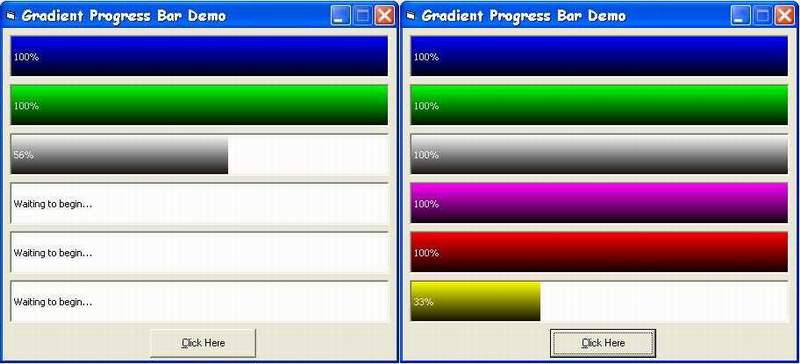



## Gradient Progress Bar Demo

### Description

This is a gradient progress bar demo using custom activex control. There are six colors altogether : blue, green, grey, purple, red and yellow. Each color comes from different control. If you want a custom gradient progress bar in your project, this is the best solution for you. Leave comments please. Also, please put some globes for my work.
 
### More Info
 

             |
---                |---
**Submitted On**   |2003-10-19 18:41:06
**By**             |[Lam Ri Hui](https://github.com/Planet-Source-Code/PSCIndex/blob/master/ByAuthor/lam-ri-hui.md)
**Level**          |Intermediate
**User Rating**    |4.8 (38 globes from 8 users)
**Compatibility**  |VB 5\.0, VB 6\.0
**Category**       |[Custom Controls/ Forms/  Menus](https://github.com/Planet-Source-Code/PSCIndex/blob/master/ByCategory/custom-controls-forms-menus__1-4.md)
**World**          |[Visual Basic](https://github.com/Planet-Source-Code/PSCIndex/blob/master/ByWorld/visual-basic.md)
**Archive File**   |[Gradient\_P16611610202003\.zip](https://github.com/Planet-Source-Code/lam-ri-hui-gradient-progress-bar-demo__1-49346/archive/master.zip)

